<h1 align="center">
⛄ My AoC Solutions 🎄
</h1>

<h1 align="center">

</h1>

<!-- AOC TILES BEGIN -->
<h1 align="center">
  2022 - 26 ⭐
</h1>
<a href="2022/01/solver.py">
  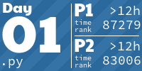
</a>
<a href="2022/02/solver.py">
  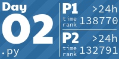
</a>
<a href="2022/03/solver.py">
  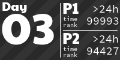
</a>
<a href="2022/04/solver.py">
  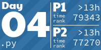
</a>
<a href="2022/05/solver.py">
  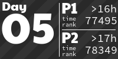
</a>
<a href="2022/06/solver.py">
  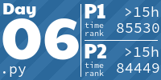
</a>
<a href="2022/07/solver.py">
  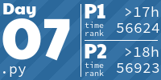
</a>
<a href="2022/08/solver.py">
  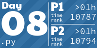
</a>
<a href="2022/09/solver.py">
  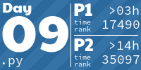
</a>
<a href="2022/10/solver.py">
  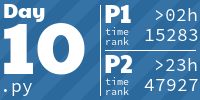
</a>
<a href="2022/11/solver.py">
  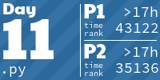
</a>
<a href="2022/12/solver.py">
  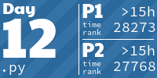
</a>
<a href="2022/13/solver.py">
  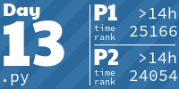
</a>
<h1 align="center">
  2021 - 15 ⭐
</h1>
<a href="None">
  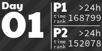
</a>
<a href="None">
  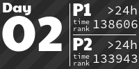
</a>
<a href="2021/03/binary_diagnostic.py">
  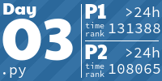
</a>
<a href="2021/04/squid_bingo.py">
  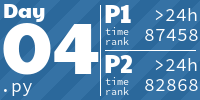
</a>
<a href="2021/05/hydrothermal_venture.py">
  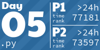
</a>
<a href="2021/06/lantern_fish.py">
  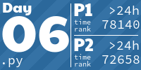
</a>
<a href="2021/07/treachery_of_whales.py">
  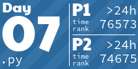
</a>

<!-- AOC TILES END -->

<h5 align="center">

<a href="https://github.com/LiquidFun/adventofcode">Tiles Credit: LiquidFun</a>

</h5>
