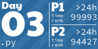

<h1 align="center">
⛄ My AoC Solutions 🎄
</h1>

<h1 align="center">

</h1>

<!-- AOC TILES BEGIN -->
<h1 align="center">
  2022 - 26 ⭐
</h1>

<h1 align="center">
  2021 - 15 ⭐
</h1>

<!-- AOC TILES END -->

<h5 align="center">

<a href="https://github.com/LiquidFun/adventofcode">Tiles Credit: LiquidFun</a>

</h5>
